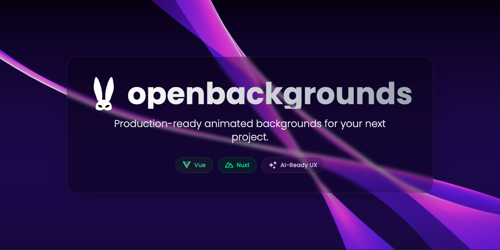
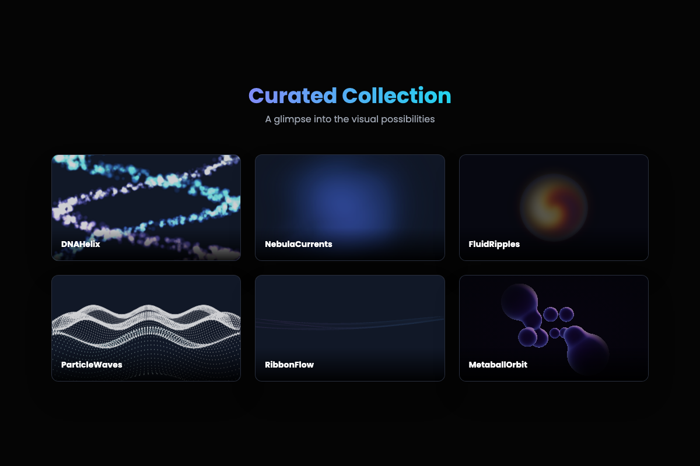
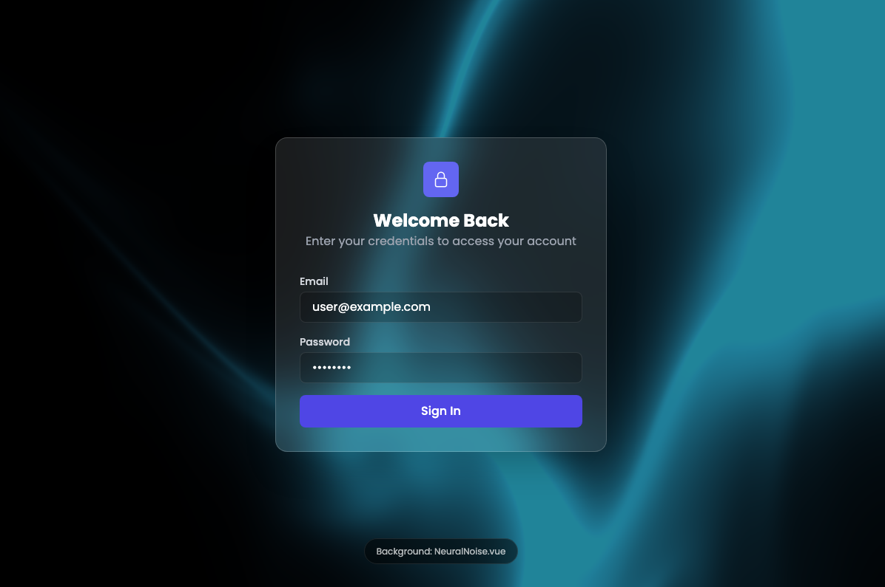
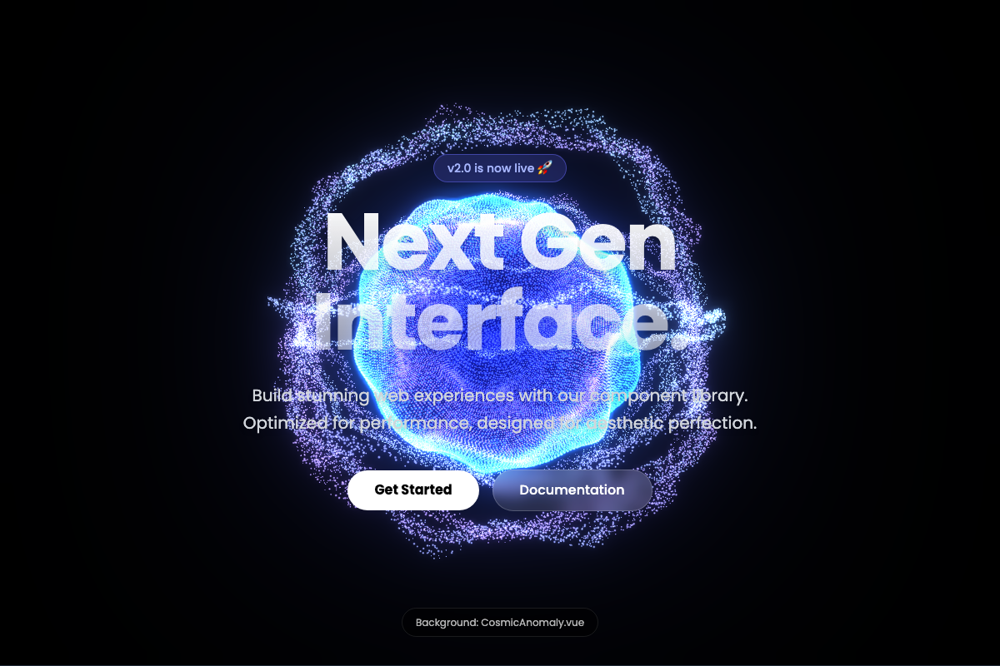

<div align="center">
  <a href="https://openbackgrounds.com">
    <kbd>
      
    </kbd>
  </a>
</div>

<div align="center">
  <a href="https://github.com/alvinreal/openbackgrounds/actions/workflows/ci.yml">
    
  </a>
</div>

<div align="center">
  <h3>Production-ready animated backgrounds for modern web & apps.</h3>
  <p>
    Build stunning interfaces with high-performance WebGL & Canvas components.<br/>
    <strong>Copy. Paste. Captivate.</strong>
  </p>
</div>

<p align="center">
  <a href="#quick-start">Quick Start</a> •
  <a href="#showcase">Showcase</a> •
  <a href="https://openbackgrounds.com">Live Demo</a> •
  <a href="#contributing">Contribute</a>
</p>

---

## ✨ Why OpenBackgrounds?

We built this because most "animated background" libraries are either 5 years old, bloated with dependencies, or just ugly. OpenBackgrounds is different:

- 🚀 **Zero-Bloat**: Each background is a standalone component.
- 🎨 **Design-First**: Crafted to look good behind text, not just as a tech demo.
- ⚡ **High Performance**: Optimized `requestAnimationFrame` loops and WebGL instance usage.
- 🛠 **Framework Ready**: Native support for **Vue 3** and **Nuxt**.

## 📸 Showcase

<div align="center">
  <kbd>
    
  </kbd>
</div>

## 🎯 Use Cases

OpenBackgrounds is designed for real-world application, not just CodePen demos.

### Perfect for Login Screens

Add subtle motion to static forms to increase perceived quality.

<div align="center">
  <kbd>
    
  </kbd>
</div>

### Impactful Hero Sections

Grab attention immediately with immersive WebGL visuals that don't distract from your copy.

<div align="center">
  <kbd>
    
  </kbd>
</div>

## 🚀 Quick Start

### Installation

Choose your flavor. We support direct copy-paste (recommended for maximum control) or usage via our CLI (coming soon).

**1. Copy the component**
Navigate to `app/components/bg/` and grab the file you want (e.g., `AuroraWaves.vue`).

**2. Install dependencies**
Most backgrounds require `three` or `simplex-noise`.

```bash
npm install three simplex-noise
# or
bun add three simplex-noise
```

**3. Use in your app**

```vue
<script setup>
import AuroraWaves from "./components/AuroraWaves.vue";
</script>

<template>
  <div class="relative w-full h-screen">
    <!-- The background sits absolutely positioned -->
    <div class="absolute inset-0 -z-10">
      <AuroraWaves />
    </div>

    <!-- Your content goes here -->
    <main class="relative z-10 flex items-center justify-center h-full">
      <h1 class="text-white text-6xl font-bold">Hello World</h1>
    </main>
  </div>
</template>
```

## 🛠 Tech Stack

Built on the shoulders of giants.

<div align="center">
  
</div>

## 🤝 Contributing

We welcome contributions! Please see our [Contributing Guide](CONTRIBUTING.md) for details.

1. Fork the Project
2. Create your Feature Branch (`git checkout -b feature/AmazingFeature`)
3. Commit your Changes (`git commit -m 'Add some AmazingFeature'`)
4. Push to the Branch (`git push origin feature/AmazingFeature`)
5. Open a Pull Request

## 📄 License

Distributed under the MIT License. See `LICENSE` for more information.

---

<div align="center">
  <sub>Built with ❤️ by the OpenBackgrounds Team</sub>
</div>
